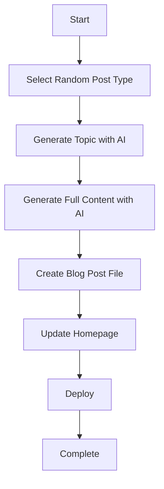

# 🤖 AI Blog Post Automation System

This system automatically generates and deploys Hebrew blog posts about cheap flights using AI.

## 🚀 Quick Start

### 1. Setup Environment

```bash
# Copy environment template
cp env.example .env

# Edit .env with your API keys
nano .env
```

### 2. Install Dependencies

```bash
npm install
```

### 3. Test Generation

```bash
# Generate a test blog post
npm run test

# Generate a real blog post
npm run generate
```

## 🔧 Configuration

### Environment Variables

| Variable | Description | Required |
|----------|-------------|----------|
| `OPENAI_API_KEY` | Your OpenAI API key | ✅ |
| `DEPLOY_HOOK_URL` | Deployment webhook URL | ❌ |
| `GITHUB_TOKEN` | GitHub token for auto-commit | ❌ |

### Blog Configuration

Edit `generate-blog-post.js` to customize:

- **Post Types**: Different categories of blog posts
- **Target Audience**: Who the content is for
- **Language**: Content language (Hebrew)
- **Tone**: Conversational, professional, etc.

## 📝 How It Works

### 1. Content Generation Process



### 2. AI Prompts

The system uses carefully crafted prompts to generate:

- **Topics**: Relevant, SEO-friendly titles
- **Content**: Structured, engaging blog posts
- **Metadata**: Categories, tags, reading time

### 3. File Structure

```
scripts/
├── generate-blog-post.js    # Main generation script
├── package.json            # Dependencies
├── deploy.sh              # Deployment script
└── README.md              # This file

Generated files:
src/app/blog/[slug]/page.tsx  # New blog post
```

## 🎯 Post Types

The system generates different types of content:

1. **טיפים לחיסכון** - Money-saving tips
2. **יעדים מומלצים** - Recommended destinations  
3. **מדריכים מקצועיים** - Professional guides
4. **חדשות תעופה** - Aviation news
5. **חבילות נסיעה** - Travel packages

## 🤖 AI Features

### Content Quality
- ✅ Hebrew language with RTL support
- ✅ SEO-optimized titles and content
- ✅ Structured with headings and sections
- ✅ Engaging, actionable advice
- ✅ Consistent tone and style

### Technical Features
- ✅ Automatic slug generation
- ✅ Metadata extraction
- ✅ Reading time calculation
- ✅ Tag generation
- ✅ Author information

## 🚀 Deployment Options

### 1. Manual Deployment

```bash
# Generate and deploy locally
./deploy.sh
```

### 2. GitHub Actions (Automated)

The system includes a GitHub Actions workflow that:

- Runs every Monday at 9 AM UTC
- Generates a new blog post
- Commits and pushes changes
- Triggers deployment

### 3. Custom Deployment

Add your deployment commands to `deploy.sh`:

```bash
# Vercel
vercel --prod

# Netlify  
netlify deploy --prod

# Custom webhook
curl -X POST "$DEPLOY_HOOK_URL"
```

## 📊 Monitoring

### Success Metrics
- ✅ Blog posts generated weekly
- ✅ Site builds successfully
- ✅ Content quality maintained
- ✅ SEO performance

### Error Handling
- ❌ API key validation
- ❌ Content generation failures
- ❌ Build errors
- ❌ Deployment issues

## 🔧 Customization

### Adding New Post Types

Edit the `POST_TYPES` array in `generate-blog-post.js`:

```javascript
POST_TYPES: [
  'טיפים לחיסכון',
  'יעדים מומלצים', 
  'מדריכים מקצועיים',
  'חדשות תעופה',
  'חבילות נסיעה',
  'חדש: ביקורות מלונות'  // Add new type
]
```

### Modifying AI Prompts

Update the prompt templates in the `generateContent()` method:

```javascript
const prompt = `
  Write a comprehensive Hebrew blog post about: "${topic}"
  
  // Add your custom requirements here
  - Include specific examples
  - Use data from 2024
  - Focus on Israeli travelers
`;
```

### Changing Schedule

Edit `.github/workflows/weekly-blog-post.yml`:

```yaml
schedule:
  # Run every Tuesday at 10 AM UTC
  - cron: '0 10 * * 2'
```

## 🛠️ Troubleshooting

### Common Issues

1. **API Key Error**
   ```bash
   export OPENAI_API_KEY=your_key_here
   ```

2. **Build Failures**
   ```bash
   npm run build
   # Check for TypeScript errors
   ```

3. **Content Quality Issues**
   - Adjust AI prompts
   - Modify temperature settings
   - Update post type selection

### Debug Mode

```bash
# Run with debug output
DEBUG=true npm run generate
```

## 📈 Analytics

Track your automated blog performance:

- **Content Quality**: Manual review of generated posts
- **SEO Performance**: Monitor search rankings
- **User Engagement**: Track page views and time on page
- **Conversion**: Monitor newsletter signups, etc.

## 🔒 Security

- ✅ API keys stored as environment variables
- ✅ No sensitive data in generated content
- ✅ GitHub Actions use secure tokens
- ✅ Automated commits are clearly marked

## 📞 Support

For issues with the automation system:

1. Check the logs in GitHub Actions
2. Test locally with `npm run test`
3. Verify API key and permissions
4. Review generated content quality

## 🎉 Success!

Your Hebrew travel blog now has:

- ✅ **Automated Content**: Weekly AI-generated posts
- ✅ **Quality Control**: Structured, engaging content
- ✅ **SEO Optimization**: Search-friendly titles and content
- ✅ **Professional Layout**: Consistent design and structure
- ✅ **Easy Deployment**: One-click publishing

Happy blogging! 🚀✈️
